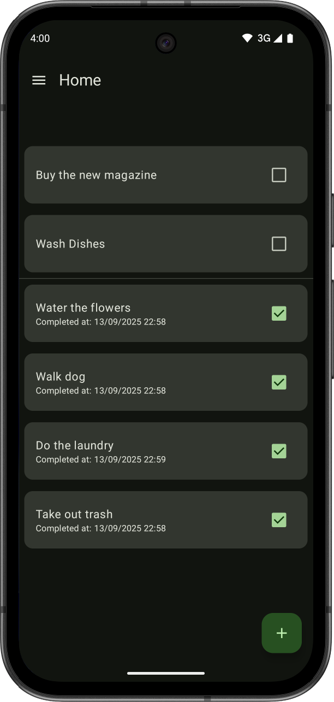

# Chares

**Chares** is a simple Android application built with **Jetpack Compose** to help users manage chores and tasks.
It provides an intuitive interface for adding, tracking, and managing daily chores, with localization support.

[](https://github.com/Ssmm8g/Chares)
[](https://opensource.org/licenses/GPL-3.0)
[](https://github.com/Damm8g/Chares/releases/latest)

## 📷 Screenshots
TODO: Add Screenshots 





## ✨ Features
- ✅ Chore management
- 🌍 Localization (English and Turkish)
- 🎨 Theme switching (System, Light, Dark)

## 🛠 Technologies
- **Kotlin**
- **Jetpack Compose**
- **Android Architecture Components** (ViewModel, LiveData, Room)
- **DataStore**

## 📌 Upcoming Features
- **Localization Improvements**: More robust language support
- **Welcome Screen**: Guide for first-time users
- **Animations**: Smooth transitions between tabs and lists (feature/animations)

## ⚠️ Known Issues
- **Translation bug**: some UI strings may not appear localized or break upon changing language

## 🚀 Installation
## 🚀 Building

### Requirements
- JDK 17+
- Android SDK (check required API levels in `build.gradle`)
- Gradle (included via `gradlew`)
- (Optional) Android Studio for IDE development

### Command Line Installation

```bash
chmod +x ./gradlew
./gradlew clean assembleDebug
```

* APK output: `app/build/outputs/apk/debug/app-debug.apk`
* Install with ADB:

```bash
adb install app/build/outputs/apk/debug/app-debug.apk
```

### Android Studio Installation
1. Open the project in Android Studio
2. Let Gradle sync finish
3. Build APK: **Build → Build Bundle(s) / APK(s) → Build APK(s)**
4. Or run directly with **Shift + F10**

## 🤝 Contributing

We welcome contributions! Please follow these steps:
1. Fork the repository
2. Create a new branch (`git checkout -b feature/YourFeature`)
3. Make your changes
4. Commit your changes (`git commit -m 'Add some feature'`)
5. Push to the branch (`git push origin feature/YourFeature`)
6. Open a Pull Request


## 📜 License

Chares
Copyright (C) 2025 Samm

This program is free software: you can redistribute it and/or modify
it under the terms of the GNU General Public License as published by
the Free Software Foundation, either version 3 of the License, or
(at your option) any later version.

This program is distributed in the hope that it will be useful,
but WITHOUT ANY WARRANTY; without even the implied warranty of
MERCHANTABILITY or FITNESS FOR A PARTICULAR PURPOSE.  See the
[GNU General Public License](LICENSE) for more details.

You should have received a copy of the GNU General Public License
along with this program.  If not, see <https://www.gnu.org/licenses/>.
